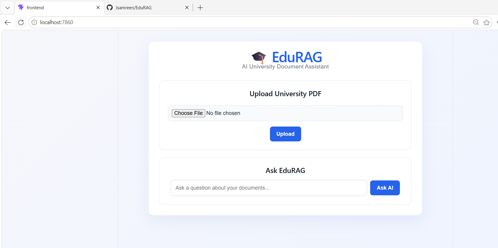
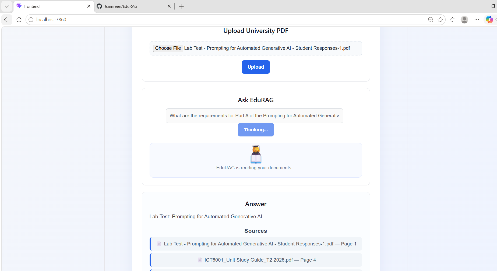
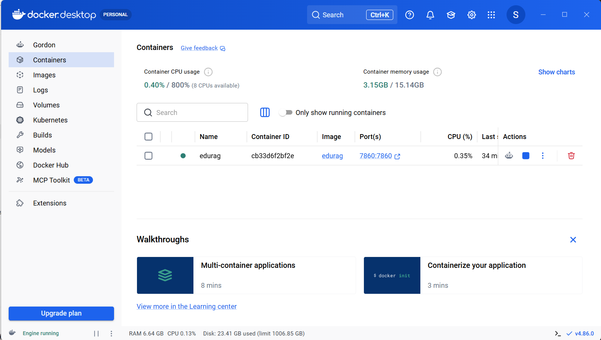

# 🎓 EduRAG – AI University Document Assistant

EduRAG is a full-stack Retrieval-Augmented Generation (RAG) application that allows users to upload university documents in PDF format and ask questions about their content.

The system automatically extracts and chunks document text, generates semantic embeddings, stores them in a vector database, retrieves relevant information for a user's question, and uses a local Large Language Model (LLM) to generate a grounded answer.

Answers also include the source document and page number used to generate the response.

---

## 🚀 Features

- 📄 Upload university PDF documents
- ⚡ Automatic PDF extraction and indexing after upload
- ✂️ Automatic document chunking
- 🧠 Semantic embeddings for document content
- 🔎 Semantic similarity search
- 📚 Multi-document knowledge base
- 🤖 Retrieval-Augmented Generation (RAG)
- 💬 Natural-language question answering
- 📑 Source document and page-number references
- 🛡️ Grounded responses based on retrieved document context
- 🖥️ Simple React user interface
- ⚙️ FastAPI REST API
- 🗄️ Persistent ChromaDB vector storage
- 🐳 Full-stack Docker containerization
- 🔒 Local LLM inference using Ollama

---
## 📸 Application Screenshots

### EduRAG User Interface

Upload university PDF documents and interact with them through the web interface.



### RAG Question Answering with Source Citations

EduRAG retrieves relevant document context and generates grounded answers while displaying the source document and page number.



### Containerized Application

The complete application is containerized with Docker, including the React frontend, FastAPI backend, ChromaDB vector store, and local Ollama integration.



## 🧠 How EduRAG Works

EduRAG follows a standard Retrieval-Augmented Generation pipeline.

```text
             ┌─────────────────┐
             │   Upload PDF    │
             └────────┬────────┘
                      │
                      ▼
             ┌─────────────────┐
             │  Extract Text   │
             └────────┬────────┘
                      │
                      ▼
             ┌─────────────────┐
             │   Split Text    │
             │   into Chunks   │
             └────────┬────────┘
                      │
                      ▼
             ┌─────────────────┐
             │    Generate     │
             │   Embeddings    │
             └────────┬────────┘
                      │
                      ▼
             ┌─────────────────┐
             │    ChromaDB     │
             │  Vector Store   │
             └────────┬────────┘
                      │
              User Question
                      │
                      ▼
             ┌─────────────────┐
             │ Semantic Search │
             └────────┬────────┘
                      │
                      ▼
             ┌─────────────────┐
             │ Retrieve Most   │
             │ Relevant Chunks │
             └────────┬────────┘
                      │
                      ▼
             ┌─────────────────┐
             │ Ollama / Llama  │
             │    3.2:3b       │
             └────────┬────────┘
                      │
                      ▼
             ┌─────────────────┐
             │ Grounded Answer │
             │ + PDF Sources   │
             └─────────────────┘
```

When a user uploads a PDF, EduRAG automatically processes and indexes the document. No separate extraction step is required.

When a question is submitted, the application performs semantic retrieval against the indexed documents and provides the most relevant chunks to the LLM as context.

The LLM is instructed to answer using the retrieved context rather than relying on unrelated external information.

---

## 🛠️ Technology Stack

### Backend

- Python
- FastAPI
- LangChain
- ChromaDB
- Ollama
- Llama 3.2:3b

### AI / RAG

- Retrieval-Augmented Generation (RAG)
- Semantic embeddings
- Vector similarity search
- Context-based question answering
- Multi-document retrieval

### Frontend

- React
- Vite
- JavaScript
- CSS

### Deployment

- Docker
- Docker volumes for persistent storage

---

## 📁 Project Structure

```text
EduRAG/
│
├── backend/
│   ├── app/
│   │   ├── api/
│   │   │   └── routes/
│   │   │
│   │   ├── core/
│   │   │   ├── config.py
│   │   │   └── logging.py
│   │   │
│   │   ├── rag/
│   │   │   ├── embedding_service.py
│   │   │   ├── llm_service.py
│   │   │   ├── retrieval_service.py
│   │   │   ├── text_splitter.py
│   │   │   └── vector_store.py
│   │   │
│   │   ├── schemas/
│   │   │
│   │   ├── services/
│   │   │   ├── document_service.py
│   │   │   └── pdf_extraction_service.py
│   │   │
│   │   └── main.py
│   │
│   ├── requirements.txt
│   └── .env.example
│
├── frontend/
│   ├── api/
│   │   └── api.js
│   │
│   ├── src/
│   │   ├── components/
│   │   │   ├── Upload.jsx
│   │   │   ├── Chat.jsx
│   │   │   └── Answer.jsx
│   │   │
│   │   ├── App.jsx
│   │   ├── App.css
│   │   └── main.jsx
│   │
│   ├── package.json
│   └── vite.config.js
│
├── sample_documents/
├── docs/
├── Dockerfile
├── .dockerignore
├── start.sh
├── PROJECT_JOURNAL.md
└── README.md
```

> Runtime-generated directories such as uploaded documents, metadata, ChromaDB data, virtual environments, `node_modules`, and environment files should not be committed to Git.

---

## 🔄 Document Processing Pipeline

When a PDF is uploaded, EduRAG automatically performs the following steps:

1. Validates the uploaded document
2. Saves the PDF
3. Extracts text from the PDF
4. Preserves document and page metadata
5. Splits the extracted text into manageable chunks
6. Generates embeddings for the chunks
7. Stores the embeddings and metadata in ChromaDB
8. Makes the document immediately available for question answering

This means users do not need to manually trigger extraction or indexing after uploading a document.

---

## 🔍 Question Answering Pipeline

When the user asks a question:

1. The question is received by the FastAPI backend.
2. EduRAG generates a semantic representation of the query.
3. ChromaDB searches for the most relevant document chunks.
4. Retrieved chunks are assembled into context.
5. The question and context are passed to the local LLM.
6. Llama 3.2 generates an answer grounded in the retrieved context.
7. EduRAG returns the answer along with the relevant document names and page numbers.

If the required information cannot be found in the retrieved document context, the system can respond:

> I couldn't find that information in the uploaded document.

---

## 📚 Multi-Document Retrieval

EduRAG supports multiple uploaded documents within the same vector knowledge base.

This allows questions to retrieve relevant information across different university documents such as:

- Unit study guides
- Assessment briefs
- Research guidelines
- Course documents
- Academic instructions

Retrieved answers include source information so the user can identify which document contributed to the response.

---

## 📑 Source Referencing

EduRAG preserves metadata during document processing.

A response can therefore include references such as:

```text
Answer:
The Unit Coordinator for ICT6001 Applied Project is Dr. Oday Al-Jerew.

Sources:
ICT6001_Unit Study Guide_T2 2026.pdf — Page 1
ICT6001 Assessment 2 Brief.pdf — Page 3
```

This improves transparency by showing where retrieved information originated.

---

# 🐳 Running EduRAG with Docker

Docker is the recommended way to run the complete application.

## Prerequisites

Install:

- Docker Desktop
- WSL 2 when running Docker Desktop on Windows

Verify Docker is running:

```bash
docker info
```

---

## 1. Clone the Repository

```bash
git clone https://github.com/Jsamreen/EduRAG.git
cd EduRAG
```

---

## 2. Build the Docker Image

From the project root:

```bash
docker build -t edurag .
```

The Docker build packages the frontend and backend into a single deployable application environment.

---

## 3. Run EduRAG

```bash
docker run \
  --name edurag \
  -p 7860:7860 \
  -v edurag_chroma:/app/chroma_db \
  -v edurag_uploads:/app/uploads \
  -v edurag_metadata:/app/metadata \
  -v edurag_ollama:/root/.ollama \
  edurag
```

### Windows PowerShell

```powershell
docker run `
  --name edurag `
  -p 7860:7860 `
  -v edurag_chroma:/app/chroma_db `
  -v edurag_uploads:/app/uploads `
  -v edurag_metadata:/app/metadata `
  -v edurag_ollama:/root/.ollama `
  edurag
```

Once the application starts, open:

```text
http://localhost:7860
```

---

## 💾 Persistent Docker Storage

EduRAG uses Docker volumes to preserve runtime data:

```text
edurag_chroma
edurag_uploads
edurag_metadata
edurag_ollama
```

These volumes allow indexed documents, metadata, vector data, and local model data to persist independently of the running container.

The container can therefore be stopped and restarted without requiring previously indexed documents to be uploaded again.

---

## ⏹️ Stop the Application

```bash
docker stop edurag
```

---

## ▶️ Start It Again

```bash
docker start edurag
```

Then visit:

```text
http://localhost:7860
```

---

# 💻 Local Development

The frontend and backend can also be run separately during development.

## Backend

Navigate to the backend:

```bash
cd backend
```

Create a virtual environment:

```bash
python -m venv venv
```

### Windows

```powershell
venv\Scripts\activate
```

Install dependencies:

```bash
pip install -r requirements.txt
```

Start Ollama and ensure the required model is available:

```bash
ollama pull llama3.2:3b
```

Run the FastAPI development server:

```bash
python -m uvicorn app.main:app --reload
```

The backend will normally be available at:

```text
http://127.0.0.1:8000
```

FastAPI Swagger documentation:

```text
http://127.0.0.1:8000/docs
```

---

## Frontend

Open another terminal:

```bash
cd frontend
```

Install dependencies:

```bash
npm install
```

Start Vite:

```bash
npm run dev
```

The development frontend will normally be available at:

```text
http://localhost:5173
```

---

## ⚙️ Environment Configuration

Environment-specific configuration should be stored in `.env` rather than committed directly to Git.

An example configuration file is provided as:

```text
backend/.env.example
```

Create your local environment file from the example when required.

Do not commit secrets or local `.env` files to the repository.

---

## 🔌 API

EduRAG exposes REST endpoints through FastAPI.

The primary application functionality includes:

```text
POST /api/v1/documents/upload
POST /api/v1/chat
```

### Document Upload

Uploads and automatically indexes a PDF into the RAG knowledge base.

### Chat

Accepts a natural-language question and returns:

- Generated answer
- Source document(s)
- Relevant page number(s)

Interactive API documentation is available through FastAPI Swagger UI during backend development.

---

## 🧪 Example Usage

### Step 1

Upload a university PDF using the EduRAG interface.

For example:

```text
ICT6001_Unit Study Guide_T2 2026.pdf
```

### Step 2

EduRAG automatically extracts and indexes the document.

### Step 3

Ask:

```text
Who is the unit coordinator?
```

### Step 4

EduRAG retrieves relevant chunks and generates an answer such as:

```text
The Unit Coordinator for ICT6001 Applied Project is Dr. Oday Al-Jerew.
```

The interface also displays the relevant source document and page number.

---

## 🎯 Project Goals

EduRAG was developed to demonstrate the practical implementation of modern Generative AI and software engineering concepts, including:

- Retrieval-Augmented Generation
- Large Language Model integration
- Semantic search
- Vector databases
- Document processing
- REST API development
- React frontend development
- Full-stack integration
- Docker containerization
- Persistent application storage

The project focuses on a practical university use case where students can interact with academic documents through natural-language questions.

---

## 🔐 Privacy and Local AI

EduRAG uses Ollama for local LLM inference.

This architecture demonstrates how a RAG application can process questions through a locally running language model rather than requiring the application to send every question to a commercial hosted LLM API.

This can be useful when experimenting with document-based AI applications where local processing and control over the AI stack are desirable.

---

## ⚠️ Current Limitations

EduRAG is currently a prototype and has several areas that could be extended in future versions:

- Retrieval quality depends on document structure and chunking
- Scanned/image-only PDFs may require OCR support
- No user authentication
- No per-user document collections
- Limited document management interface
- Local LLM performance depends on available hardware
- Large document collections may require additional retrieval optimisation

---

## 🔮 Future Improvements

Potential future enhancements include:

- Conversation history
- Document selection/filtering
- Hybrid keyword + semantic search
- Improved retrieval ranking
- User authentication
- Multiple knowledge bases
- Additional document formats
- Cloud deployment
- Improved document management
- More advanced RAG evaluation
- Streaming AI responses

---

## 📊 Current Status

The current version supports an end-to-end workflow:

```text
Upload PDF
    ↓
Automatic Extraction
    ↓
Chunking
    ↓
Embeddings
    ↓
ChromaDB
    ↓
Semantic Retrieval
    ↓
Local LLM
    ↓
Grounded Answer
    ↓
Source Document + Page
```

The React frontend and FastAPI backend are integrated and can run together as a containerized application.

---

## 👩‍💻 Author

**Javeria**

Master of Information Technology  
Melbourne, Australia

Areas of interest:

- Software Engineering
- Artificial Intelligence
- Generative AI
- Retrieval-Augmented Generation
- Cloud Technologies

---

## 📌 Project Purpose

EduRAG was developed as a practical AI/software engineering portfolio project demonstrating how Retrieval-Augmented Generation can be applied to university knowledge and academic documents.

The project combines backend engineering, frontend development, document processing, vector search, local Large Language Models, and containerization into a complete end-to-end application.